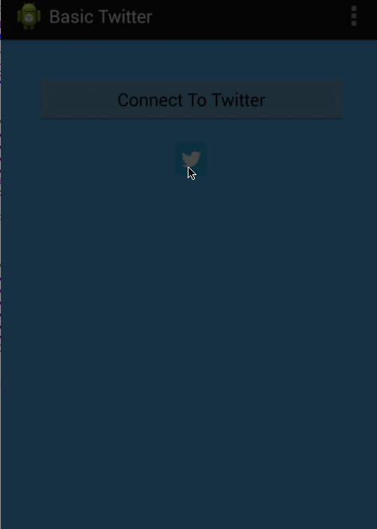
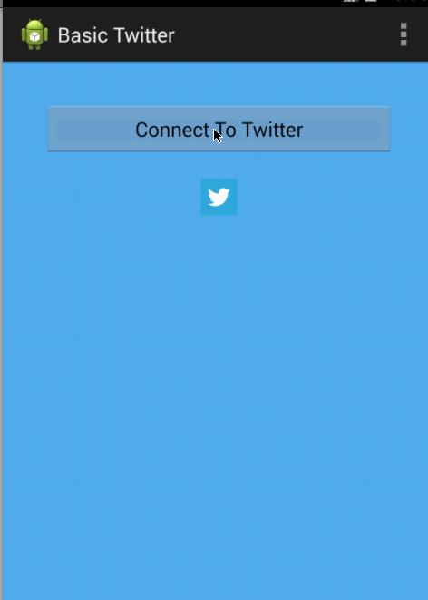

Basic Twitter Client

Time spent: 9 hours spent in total

Completed user stories:
 -</b>User can sign in using OAuth login flow
 
 -</b>User can view last 25 tweets from their home timeline
 
 -</b>User should be able to see the user, body and timestamp for tweet
 
 -</b>User should be displayed the relative timestamp for a tweet "8m", "7h"

Optional : Links in tweets are clickable and viewable

- </b>User can load more tweets once they reach the bottom of the list using "infinite scroll" pagination
- </b>User can compose a new tweet

    - User can click a “Compose” icon in the Action Bar on the top right
    - User will have a Compose view opened
    - User can enter a message and hit a button to post to twitter
    - User should be taken back to home timeline with new tweet visible
  

- [X] <b>Optional:</b> User can refresh tweets timeline by pulling down to refresh (i.e pull-to-refresh)

3.

Part 2 (Fragments)
 This assignment took 9 hours and includes the below user stories
 
 -User can view their home timeline tweets.
 
 -User can view the recent mentions of their username.
 
 -User can scroll to bottom of either of these lists and new tweets will load ("infinite scroll")
 
 -User can navigate to view their own profile
 
 -User can see picture, tagline, # of followers, # of following, and tweets on their profile.
 
 -User can click on the profile image in any tweet to see another user's profile.
 
 -User can see picture, tagline, # of followers, # of following, and tweets of clicked user.
 
 -Profile view should include that user's timeline.
 
 
 
